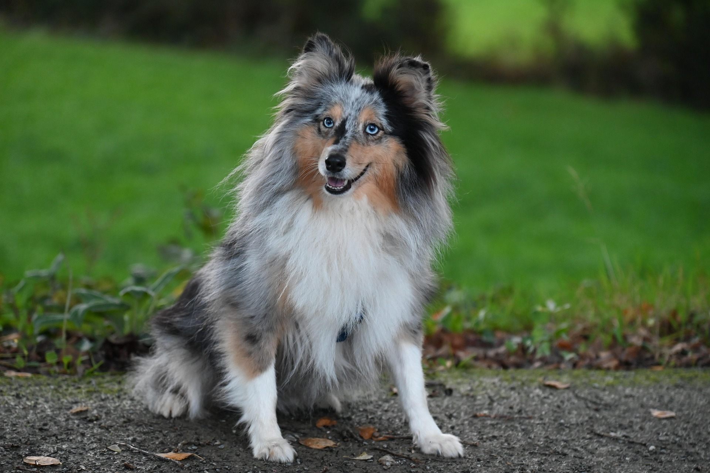
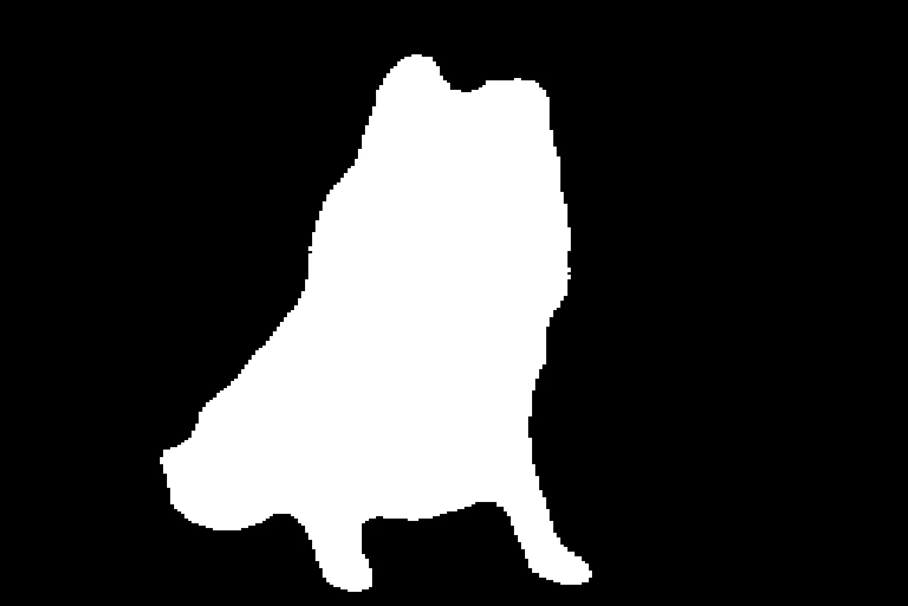
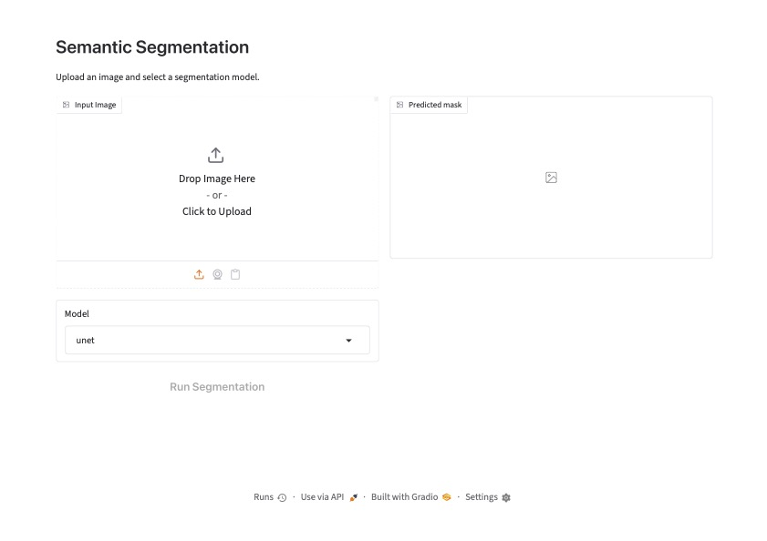

# Semantic Segmentation

Binary semantic segmentation on the Oxford-IIIT Pet dataset using U-Net based architectures.  
This repository contains both training code and a FastAPI + Gradio inference service.

Model weights are available on Hugging Face:  
[`Jolie11/semantic-segmentation-models`](https://huggingface.co/Jolie11/semantic-segmentation-models)

## Features

- Two models:
  - `unet`: Standard U-Net with DoubleConv blocks
  - `resnet34_unet`: ResNet34 encoder + U-Net decoder
- Training on Oxford-IIIT Pet (binary foreground / background using trimaps)
- Dice score evaluation (ignoring boundary pixels)
- FastAPI inference service + Gradio web demo
- Docker support for the inference service

## Project Structure

```text
├── train/                          # Training & offline inference
│   ├── models/
│   │   ├── unet.py
│   │   ├── resnet34_unet.py
│   │   └── residual_unet.py
│   ├── train.py                    # Train resnet34_unet
│   ├── train_u.py                  # Train unet
│   ├── evaluate.py
│   ├── inference.py                # Offline inference (resnet34_unet)
│   ├── inf_u.py                    # Offline inference (unet)
│   ├── oxford_pet.py               # Dataset & transforms
│   ├── utils.py
│   └── requirements.txt
│
├── src/                            
│   ├── models/
│   │   ├── unet.py
│   │   └── resnet34_unet.py
│   ├── app.py
│   ├── inference.py
│   └── utils.py
│
├── assets/                         
│   ├── example.jpg
│   └── pred mask.webp
│
├── Dockerfile
├── requirements.txt                
└── .gitignore
```

## Results

| Input | Predicted Mask |
|:-----:|:--------------:|
|  |  |

*Example image by [JACLOU-DL](https://pixabay.com/users/jaclou-dl-5602247/?utm_source=link-attribution&utm_medium=referral&utm_campaign=image&utm_content=8342397) from [Pixabay](https://pixabay.com//?utm_source=link-attribution&utm_medium=referral&utm_campaign=image&utm_content=8342397)*

## Dataset

This project uses the [Oxford-IIIT Pet Dataset](https://www.kaggle.com/datasets/julinmaloof/the-oxfordiiit-pet-dataset).

## Training

### 1. Prepare the dataset

Download the Oxford-IIIT Pet dataset and place it under `dataset/oxford-iiit-pet` (or change the path):

```bash
# Expected structure
dataset/oxford-iiit-pet/
├── images/
└── annotations/
    ├── trimaps/
    ├── trainval.txt
    └── test.txt
```

The dataset loader will automatically split `trainval.txt` into 90% train / 10% validation.

### 2. Install training dependencies

```bash
cd train
pip install -r requirements.txt
```

### 3. Train

```bash
# Train U-Net
python train_u.py 

# Train ResNet34-UNet
python train.py 
```

Best model (highest validation Dice) is saved as `best_model.pth`.  

### 4. Offline inference 

```bash
# U-net
python inf_u.py 

# ResNet34-UNet
python inference.py 
```

## Inference Service (FastAPI + Gradio)

### Local

```bash
pip install -r requirements.txt

cd src
uvicorn app:app --host 0.0.0.0 --port 8000
```

- API docs: http://localhost:8000/docs  
- Gradio demo: http://localhost:8000/demo

### Docker

```bash
docker build -t semantic-segmentation .
docker run --gpus all -p 8000:8000 semantic-segmentation
```

> Base image: `pytorch/pytorch:2.14.0-cuda13.2-cudnn9-runtime`

### API Usage


## Gradio Demo

After starting the service, open the interactive demo at:

**http://localhost:8000/demo**

Upload an image and select a model (`unet` or `resnet34_unet`) to generate the segmentation mask.




## Model Details

- **unet**: Classic U-Net (DoubleConv + skip connections)
- **resnet34_unet**: ResNet34 encoder + U-Net style decoder

Both models are trained for binary segmentation.  
During inference, `sigmoid` + threshold `0.5` is applied.  
Images are resized to 256×256 for prediction and then restored to the original size.

## Notes

- Training uses `BCEWithLogitsLoss` with valid-pixel masking (boundary pixels from the trimap are ignored).
- Evaluation metric: Dice score (also ignoring boundary pixels).
- Inference service downloads model weights from Hugging Face at startup.
